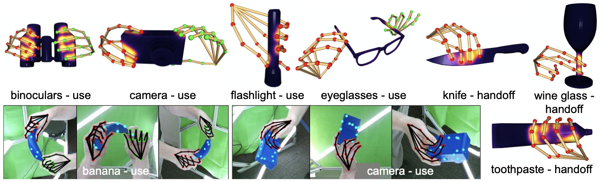

[](https://paperswithcode.com/sota/grasp-contact-prediction-on-contactpose?p=contactpose-a-dataset-of-grasps-with-object)


# [ContactPose](https://contactpose.cc.gatech.edu)

<figure>

<figcaption>Example ContactPose data: Contact Maps, 3D hand pose, and RGB-D grasp images for functional grasps.</figcaption>
</figure>

Code for the ContactPose dataset released in the following paper:

[ContactPose: A Dataset of Grasps with Object Contact and Hand Pose](https://contactpose.cc.gatech.edu) - 

[Samarth Brahmbhatt](https://samarth-robo.github.io/),
[Chengcheng Tang](https://scholar.google.com/citations?hl=en&user=WbG27wQAAAAJ),
[Christopher D. Twigg](https://scholar.google.com/citations?hl=en&user=aN-lQ0sAAAAJ),
[Charles C. Kemp](http://charliekemp.com/), and
[James Hays](https://www.cc.gatech.edu/~hays/),

**ECCV 2020**.

- [Explore the dataset](https://contactpose.cc.gatech.edu/contactpose_explorer.html)
- [hand-object contact ML code](https://github.com/samarth-robo/ContactPose-ML)
- [ROS code](https://github.com/samarth-robo/contactpose_ros_utils) used for recording the dataset

## Citation
```
@InProceedings{Brahmbhatt_2020_ECCV,
author = {Brahmbhatt, Samarth and Tang, Chengcheng and Twigg, Christopher D. and Kemp, Charles C. and Hays, James},
title = {{ContactPose}: A Dataset of Grasps with Object Contact and Hand Pose},
booktitle = {The European Conference on Computer Vision (ECCV)},
month = {August},
year = {2020}
}
```

# [Documentation](docs/doc.md)

# Licensing
- Code: [MIT License](LICENSE.txt)
- 3D models: each model has its own license, see `README.txt` and `licenses.json` in the [downloads](docs/doc.md#3d-models-and-3d-printing)
- All other data: [MIT License](LICENSE.txt)

# Updates
- [ ] [Fix annotation errors](https://github.com/facebookresearch/ContactPose/issues/7) in data from participants 32, 33, 34, 35
- [ ] Use [rclone](https://github.com/rclone/rclone) for Dropbox downloads
- [ ] [Make depth images optional in cropping script](https://github.com/facebookresearch/ContactPose/issues/6)
- [x] [Robust networking utilities](utilities/networking.py) for data download with exponential backoff in case of connection failure
- [x] [Speed up dataset download by organizing images into videos](docs/doc.md#download-rgb-images-only)
- [x] [Release object 3D models](docs/doc.md#3d-models-and-3d-printing)
- [x] [Code for cropping images around hand-object](demo.ipynb)
- [x] [Release contact modeling ML code](https://github.com/samarth-robo/ContactPose-ML)
- [ ] Release more data analysis code
- [x] [Release MANO fitting code](utilities/mano_fitting.py) | [demo at end of notebook](demo.ipynb)
- [x] [RGB-D image background randomization support](docs/doc.md#image-preprocessing)
- [x] **new** Release [ROS code](https://github.com/samarth-robo/contactpose_ros_utils) used for recording the dataset
- [x] [MANO and object mesh rendering](docs/rendering.md)
- [ ] Documentation using [Read the Docs](https://readthedocs.org)
