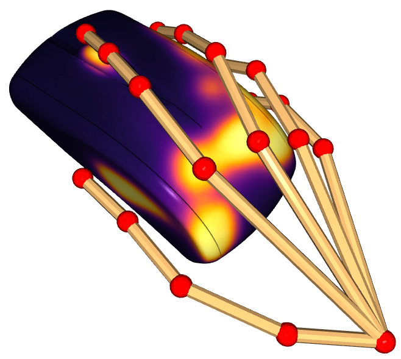
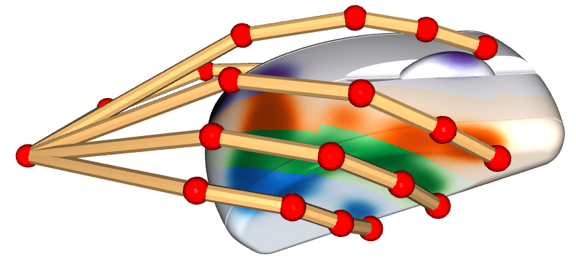
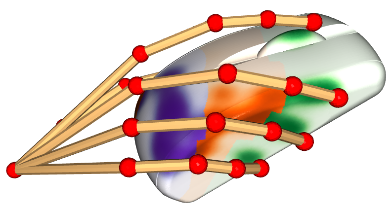
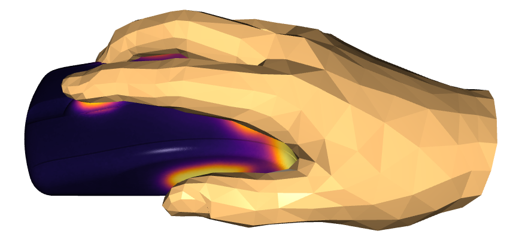

# [ContactPose](https://contactpose.cc.gatech.edu)

Code for the ContactPose dataset released in the following paper:

[ContactPose: A Dataset of Grasps with Object Contact and Hand Pose]() - 

[Samarth Brahmbhatt](https://samarth-robo.github.io/),
[Chengcheng Tang](https://scholar.google.com/citations?hl=en&user=WbG27wQAAAAJ),
[Christopher D. Twigg](https://scholar.google.com/citations?hl=en&user=aN-lQ0sAAAAJ),
[Charles C. Kemp](http://charliekemp.com/), and
[James Hays](https://www.cc.gatech.edu/~hays/),

**ECCV 2020**.

Please visit [http://contactpose.cc.gatech.edu](http://contactpose.cc.gatech.edu) to explore the dataset.

## Citation
```
@InProceedings{Brahmbhatt_2020_ECCV,
author = {Brahmbhatt, Samarth and Tang, Chengcheng and Twigg, Christopher D. and Kemp, Charles C. and Hays, James},
title = {{ContactPose}: A Dataset of Grasps with Object Contact and Hand Pose},
booktitle = {The European Conference on Computer Vision (ECCV)},
month = {August},
year = {2020}
}
```

# Getting Started

1. Install [Miniconda](https://docs.conda.io/en/latest/miniconda.html). Create the `contactpose` conda environment:
`conda env create -f environment.yml`. Activate it:
```bash
$ source activate contactpose
```
The following commands should be run after activating the conda env.

2. Startup by downloading grasp data (pose annotations and camera calibrations) for the entire dataset,
contact maps for participant \#28 all 'use' intent grasps, and RGB-D images for
participant \#28 'bowl' object, 'use' intent grasp. By default it will
download to `data/contactpose_data`, but you can also provide a directory of
your choice. It will symlink that directory to `data/contactpose_data` for easy access. 

```bash
$ python startup.py --data_dir <dir_name>
ContactPose data directory is data/contactpose_data
Downloading 3D model marker locations...
100%|███████████████████████████████████████████████████████████████████████████████████████████████████████████████████████████████████████████| 103k/103k [00:05<00:00, 17.3kiB/s]
Extracting...
Downloading grasps...
100%|████████████████████████████████████████████████████████████████████████████████████████████████████████████████████████████████████████████| 126M/126M [03:45<00:00, 559kiB/s]
Extracting...
100%|█████████████████████████████████████████████████████████████████████████████████████████████████████████████████████████████████████████████| 100/100 [01:55<00:00,  1.15s/it]
Downloading full28_use contact maps...
100%|█████████████████████████████████████████████████████████████████████████████████████████████████████████████████████████████████████████| 96.8M/96.8M [00:03<00:00, 29.1MiB/s]
Extracting...
Downloading full28_use images...
  0%|                                                                                                                                                         | 0/1 [00:00<?, ?it/s]bowl
100%|█████████████████████████████████████████████████████████████████████████████████████████████████████████████████████████████████████████| 2.08G/2.08G [00:45<00:00, 45.6MiB/s]
100%|█████████████████████████████████████████████████████████████████████████████████████████████████████████████████████████████████████████████████| 1/1 [00:47<00:00, 47.23s/it]
Extracting...
1it [00:33, 33.48s/it]
```

3. Download MANO code and models from [https://mano.is.tue.mpg.de](https://mano.is.tue.mpg.de)
and unzip it in to `thirdparty/mano`. **Note**: MANO code is written for Python 2,
but we use it in Python 3. We have developed work-arounds for all issue except one:
you should comment out the `print 'FINITO'` (last line) statement in
`thirdparty/mano/webuser/smpl_handpca_wrapper_HAND_only.py`. MPI license does 
not allow re-distribution of their MANO code.

4. You can 3D visualize contact maps and 3D hand joints:
```bash
$ python scripts/show_contactmap.py --p_num 28 --intent use --object_name mouse --mode simple_hands
```

`simple_hands` mode


`semantic_hands_fingers` mode


`semantic_hands_phalanges` mode


`simple_mano` mode


# [Demo notebook](demo.ipynb)
Information on accessing images, poses, and calibration data.


# Download Options

This is done through `scripts/download_data.py`:
```bash
$ python scripts/download_data.py --help
usage: download_data.py [-h] --type {grasps,images,contact_maps,markers,3Dmodels}
                        [--p_nums P_NUMS] [--intents INTENTS]
                        [--images_dload_dir IMAGES_DLOAD_DIR]

optional arguments:
  -h, --help            show this help message and exit
  --type {grasps,images,contact_maps}
  --p_nums P_NUMS       Participant numbers E.g. 1, 1,2, or 1-5
  --intents INTENTS     use, handoff, or use,handoff
  --images_dload_dir IMAGES_DLOAD_DIR
                        Directory where images will be downloaded.They will be
                        symlinked to the appropriate location
```

You can download more contact maps:

```bash
$ python scripts/download_data.py --p_nums 1-10 --intents use,handoff --type contact_maps
```

And more RGB-D images:

```bash
$ python scripts/download_data.py --p_nums 1-10 --intents use,handoff --type images \
--images_dload_dir <dir_name>
```

The entire RGB-D collection is ~ 2.5 TB. Hence the script provides the option to
provide an image download directory. This can be on a large SSD drive, for example.
It will automatically symlink the downloaded data to the appropriate location
in `data/contactpose_data` for easy access. The image download directory defaults
to `data/contactpose_data`.

3D models of objects and locations of markers placed on them (this is already
done if you run `startup.py`):

```bash
$ python scripts/download_data.py --type 3Dmodels
$ python scripts/download_data.py --type markers
```

All grasp information - 3D joints, MANO fits, camera calibrations - (this is already
done if you run `startup.py`):

```bash
$ python scripts/download_data.py --type grasps
```

# 3D Models and 3D Printing
[STL files](https://www.dropbox.com/sh/g1nv595mvhnnxoi/AACEF0x4Hj22MctIpzFCkIVCa?dl=1) | 
[STL files with cylindrical recesses for markers](https://www.dropbox.com/sh/m14c4u2yr029f8k/AAA1yGl-k_4XEXElfmCgF1Fpa?dl=1) |
[High-poly PLY files](https://www.dropbox.com/sh/l76a01eyx6sxoll/AACrvU_QYRG8A8pevM1QPCs9a?dl=1)

The cylindrical recesses were produced using [this script](). Please see
[this README](https://github.com/samarth-robo/contactdb_utils#3d-printing)
for more details about 3D printing the objects.

# TODO
- [ x ] Release object 3D models
- [ x ] Code for cropping images around hand-object
- [ ] Release contact modeling ML code
- [ ] Release ROS code used for recording the dataset
- [ ] MANO mesh rendering
- [ ] Proper documentation using [Read the Docs](https://readthedocs.org)
