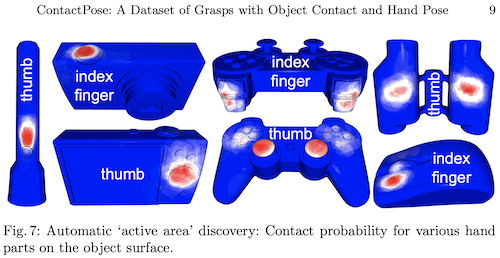

# Hand Contact Probabilities
## Phalange-level
If you are interested in phalange-level association (Fig 5(b) in the paper),
look at [`scripts/show_contactmap.py`](../scripts/show_contactmap.py).
`finger_idx` and `part_idx` contain the indices of the finger and the phalange
closest to each object point. Then `apply_semantic_colormap_to_mesh()` takes
that and the thermal contact value at each point to create the color-coded
contact maps shown in the README.

## Fine-grained
E.g. Fig 5(a) in the paper. This is done with
[`scripts/data_analysis/hand_contact_prob.py`](../scripts/data_analysis/hand_contact_prob.py),
for example
computing the hand contact probablity for all grasps by participant #28, `use` intent:
```bash
$ python scripts/data_analysis/hand_contact_prob.py --p_num 28 --intent use
```


You can average various slices of the dataset in this script by choosing `p_num`,
`object_name`, and `intent`:
```bash
(contactpose) $ python scripts/data_analysis/hand_contact_prob.py --help
usage: hand_contact_prob.py [-h] [--p_num P_NUM]
                            [--intent {use,handoff,use,handoff}]
                            [--object_name OBJECT_NAME]

optional arguments:
  -h, --help            show this help message and exit
  --p_num P_NUM         Participant number, comma or - separated, ignore for
                        all participants
  --intent {use,handoff,use,handoff}
                        Grasp intent
  --object_name OBJECT_NAME
                        Name of object, comma separated, ignore for all
                        objects
```

# Active Areas
These are areas on the object surface which are highly likely to be touched.
For more details see Fig. 7 in the paper.
[`scripts/data_analysis/active_areas.py`](../scripts/data_analysis/active_areas.py)
allows you to discover the active areas for various objects, corresponding to
a particular part of the hand.

Use without the `--show` switch to calculate and save the active area information
in `data/contactpose_data`, and use the `--show` switch to display the object mesh
with active areas textured on it.



```bash
(contactpose) $ python scripts/data_analysis/active_areas.py --help
usage: active_areas.py [-h] --finger_idx {0,1,2,3,4} --part_idx {0,1,2,3}
                       --object_name OBJECT_NAME --intent {use,handoff}
                       [--p_nums P_NUMS] [--show]

optional arguments:
  -h, --help            show this help message and exit
  --finger_idx {0,1,2,3,4}
                        0->4 : thumb->little
  --part_idx {0,1,2,3}  0->3 : proximal to distal phalanges, 3 = finger tip
  --object_name OBJECT_NAME
  --intent {use,handoff}
  --p_nums P_NUMS       Participant numbers, comma or - separated.Skipping
                        means all participants
  --show
```