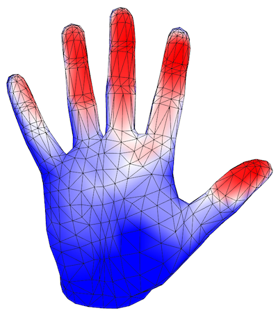

# Hand Contact Probabilities
## Phalange-level
If you are interested in phalange-level association (Fig 5(b) in the paper),
look at `scripts/show_contactmap.py`. `finger_idx` and `part_idx` contain the
indices of the finger and the phalange closest to each object point.
Then `apply_semantic_colormap_to_mesh()` takes that and the thermal contact value
at each point to create the color-coded contact maps shown in the README.

## Fine-grained
E.g. Fig 5(a) in the paper). This is done with the following script, for example
computing the hand contact probablity for all grasps by participant #28, `use` intent:
```bash
$ python scripts/data_analysis/hand_contact_prob.py --p_num 28 --intent use
```


You can average various slices of the dataset in this script by choosing `p_num`,
`object_name`, and `intent`:
```bash
$ python scripts/data_analysis/hand_contact_prob.py --help
usage: hand_contact_prob.py [-h] [--p_num P_NUM]
                            [--intent {use,handoff,use,handoff}]
                            [--object_name OBJECT_NAME]

optional arguments:
  -h, --help            show this help message and exit
  --p_num P_NUM         Participant number, comma or - separated, ignore for
                        all participants
  --intent {use,handoff,use,handoff}
                        Grasp intent
  --object_name OBJECT_NAME
                        Name of object, comma separated, ignore for all
                        objects
```