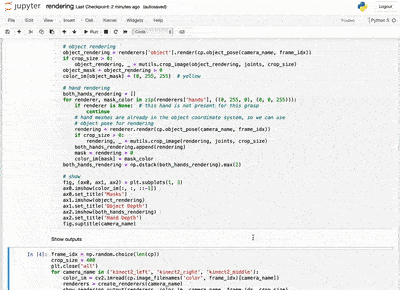

# Rendering and Masking Operations
These operations allow you to render depth maps of the object and hand in each image. You can then derive masks by thresholding the depth images. All rendering is done with [pyrender](https://pyrender.readthedocs.io/en/latest/).

## Setup
It is important to install pyrender within the `contactpose` conda environment. In our experience pyrender headless rendering works only in Linux. The following instructions are adapted from the [official installation guide](https://pyrender.readthedocs.io/en/latest/install/index.html).

- Build OSMesa from source and install to the `contactpose` conda env:
```bash
$ conda activate contactpose
(contactpose) $ sudo apt-get install llvm-6.0 freeglut3 freeglut3-dev
(contactpose) $ cd ~/Downloads && wget ftp://ftp.freedesktop.org/pub/mesa/mesa-18.3.3.tar.gz
(contactpose) $ tar xfv mesa-18.3.3.tar.gz
(contactpose) $ cd mesa-18.3.3
(contactpose) $ ./configure --prefix=${CONDA_PREFIX}          \
            --enable-opengl --disable-gles1 --disable-gles2   \
            --disable-va --disable-xvmc --disable-vdpau       \
            --enable-shared-glapi                             \
            --disable-texture-float                           \
            --enable-gallium-llvm --enable-llvm-shared-libs   \
            --with-gallium-drivers=swrast,swr                 \
            --disable-dri --with-dri-drivers=                 \
            --disable-egl --with-egl-platforms= --disable-gbm \
            --disable-glx                                     \
            --disable-osmesa --enable-gallium-osmesa          \
            ac_cv_path_LLVM_CONFIG=llvm-config-6.0
(contactpose) $ make -j8
(contactpose) $ make install
```

- Set some environment variables to be loaded when the conda env is activated
(instructions from
[here](https://docs.conda.io/projects/conda/en/latest/user-guide/tasks/manage-environments.html#saving-environment-variables)):
```bash
(contactpose) $ cd $CONDA_PREFIX
(contactpose) $ mkdir -p ./etc/conda/activate.d
(contactpose) $ mkdir -p ./etc/conda/deactivate.d
(contactpose) $ touch ./etc/conda/activate.d/env_vars.sh
(contactpose) $ touch ./etc/conda/deactivate.d/env_vars.sh
```

Edit `./etc/conda/activate.d/env_vars.sh` as follows:
```
#!/bin/sh

export OLD_LIBRARY_PATH=$LIBRARY_PATH
export OLD_LD_LIBRARY_PATH=$LD_LIBRARY_PATH
export OLD_C_INCLUDE_PATH=$C_INCLUDE_PATH
export OLD_CPLUS_INCLUDE_PATH=$CPLUS_INCLUDE_PATH

MESA_HOME=$CONDA_PREFIX
export LIBRARY_PATH=$LIBRARY_PATH:$MESA_HOME/lib
export LD_LIBRARY_PATH=$LD_LIBRARY_PATH:$MESA_HOME/lib
export C_INCLUDE_PATH=$C_INCLUDE_PATH:$MESA_HOME/include
export CPLUS_INCLUDE_PATH=$CPLUS_INCLUDE_PATH:$MESA_HOME/include
```

Edit `./etc/conda/deactivate.d/env_vars.sh` as follows:
```
!/bin/sh

export LIBRARY_PATH=$OLD_LIBRARY_PATH
export LD_LIBRARY_PATH=$OLD_LD_LIBRARY_PATH
export C_INCLUDE_PATH=$OLD_C_INCLUDE_PATH
export CPLUS_INCLUDE_PATH=$OLD_CPLUS_INCLUDE_PATH

unset OLD_LIBRARY_PATH
unset OLD_LD_LIBRARY_PATH
unset OLD_C_INCLUDE_PATH
unset OLD_CPLUS_INCLUDE_PATH
```

- Install a compatible fork of PyOpenGL:
```bash
(contactpose) $ git clone git@github.com:mmatl/pyopengl.git
(contactpose) $ pip install ./pyopengl
```

- Finally, install `pyrender`:
```bash
(contactpose) $ pip install pyrender
```


## [Demo Notebook](../rendering.ipynb)
[](../rendering.ipynb)
